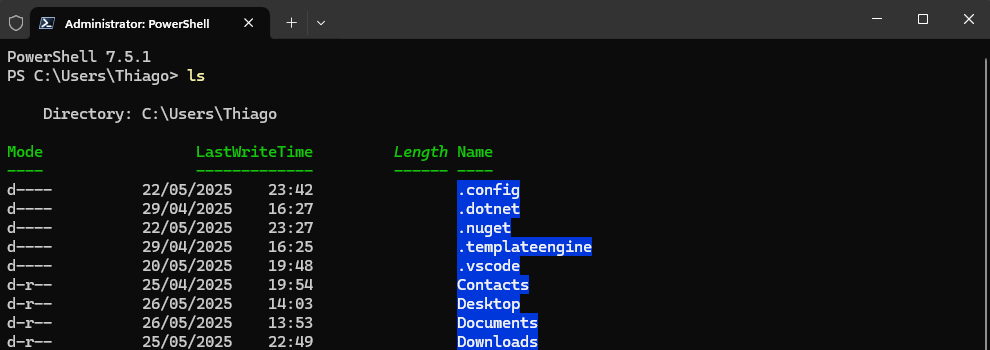
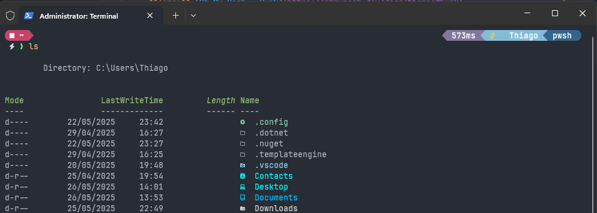

# 🖥️ Meu Terminal

Olá Dev!

Essa é a minha configuração para o terminal do Windows 11 (Powershell), aplicando:

- **Fonte:** [JetBrainsMono Nerd Font Mono](https://github.com/ryanoasis/nerd-fonts/releases/download/v3.4.0/JetBrainsMono.zip)
- **Tema:** [Oh My Posh - Hunk](https://ohmyposh.dev/docs/themes#hunk)
- **Cores:** One Dark - personalizado

Antes:



Depois:



## ➡️ Instalação

1. Baixe e instale a fonte [JetBrainsMono Nerd Font Mono](https://github.com/ryanoasis/nerd-fonts/releases/download/v3.4.0/JetBrainsMono.zip).

1. Atualize o PowerShell para versão mais recente (7.x.x). Feche após a atualização e use essa versão.

   ```powershell
   winget install --id Microsoft.Powershell --source winget
   ```

1. Habilite o PowerShell para Executar Scripts:

   Abra o **PowerShell como Administrador** e execute o seguinte comando para permitir execução de scripts temporariamente:

   ```powershell
   Set-ExecutionPolicy Bypass -Scope Process -Force
   ```

1. Instale o conjunto de ícones:

   ```powershell
   Install-Module -Name Terminal-Icons -Repository PSGallery -Scope CurrentUser -Force
   ```

1. Instale o Chocolatey (choco)

   Com o PowerShell ainda aberto como Administrador, execute:

   ```powershell
   iex ((New-Object System.Net.WebClient).DownloadString('https://community.chocolatey.org/install.ps1'))
   ```

   Verifique se a instalação foi bem-sucedida:

   ```powershell
   choco --version
   ```

1. Instale o Oh My Posh via Chocolatey

   Com o Chocolatey instalado, rode:

   ```powershell
   choco install oh-my-posh -y
   ```

   Confirme a instalação com:

   ```powershell
   oh-my-posh --version
   ```

## 📒 Alterando perfil do terminal

1. Ainda com o terminal aberto, aperte `ctrl + ,`.
2. Clique na engrenagem, no canto inferior esquerdo, para abrir o arquivo de configuração `settings.json`.
3. Substitua a configuração padrão por [essa](settings.json) e salve.
4. Feche e abra novamente o terminal.

# 🌟 Extras

- [Terminal integrado VS Code](docs/oh-my-posh-vscode.md)
- [Terminal integrado JetBrains Rider](docs/oh-my-posh-rider.md)
