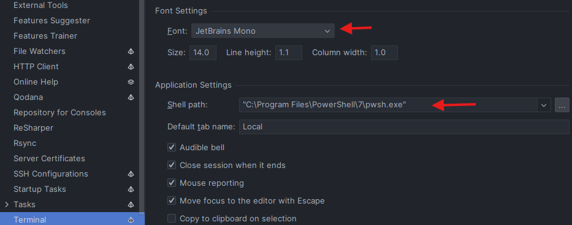
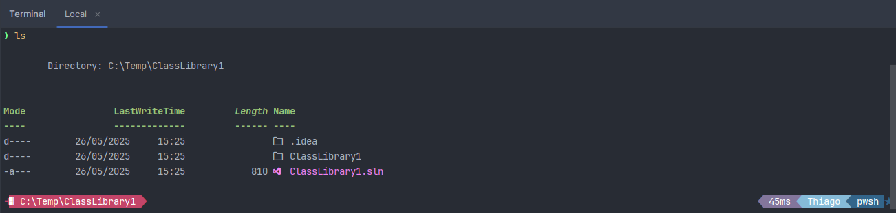

# 🎨 Configurando no JetBrains Rider

Aqui vamos aplicar uma abordagem diretamente no terminal padrão do terminal do Windows.

1. Abra o terminal e rode o comando:

   ```powershell
   # Use o executar do Windows (Win + R)
   notepad $Profile
   ```

1. Agora no bloco de notas, adicione o script e salve:

   ```powershell
   # Só executa se o terminal for o integrado do Rider
   if ($env:TERMINAL_EMULATOR -eq "JetBrains-JediTerm") {
      if (Get-Command oh-my-posh -ErrorAction SilentlyContinue) {
         oh-my-posh init pwsh --config "$env:POSH_THEMES_PATH\hunk.omp.json" | Invoke-Expression
      }

      if (Get-Module -ListAvailable -Name Terminal-Icons) {
         Import-Module Terminal-Icons
      }
   }
   ```

1. Abra o `Rider -> Configure -> Settings -> Terminal`. A nerd font não renderiza bem, então mantenha a fonte padrão ou outra a sua escolha.

   

1. Feche e abra o terminal integrado do Rider.

   
