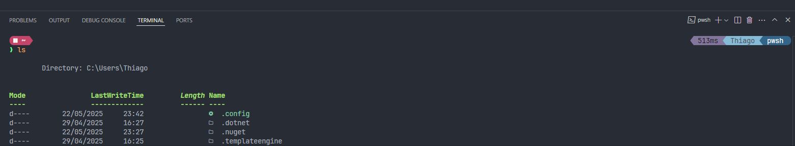

# 🎨 Configurando no VS Code

1. Abra o `settings.json` do VS code:

   ```powershell
   # Use o executar do Windows (Win + R)
   %USERPROFILE%\AppData\Roaming\Code\User\settings.json
   ```

1. Adicione ou altere o conteúdo relacionado ao uso de fontes com essa [configuração](../assets/vscode/settings.json).

1. Feche e abra o terminal integrado do VS Code.
   
